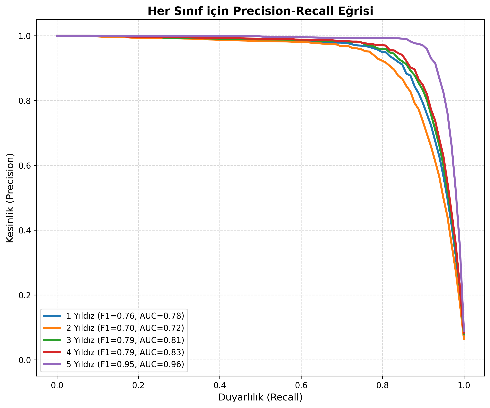
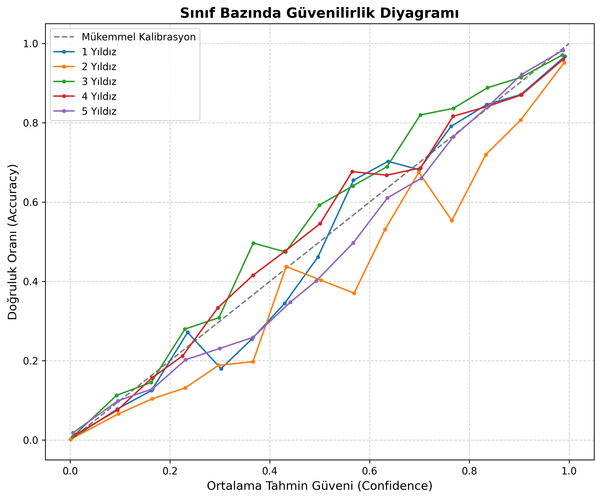

# 🌟 YıldızSezar: Turkish E-Commerce Review Classifier

[](https://www.python.org/)
[](https://pytorch.org/)
[](https://huggingface.co/spaces/ilkayO/YildizSezar-Demo)
[](https://colab.research.google.com/github/ilkay-onay/YildizSezar-Review-Classifier/blob/main/YildizSezar_Demo.ipynb)

This repository contains the official implementation of **YıldızSezar**, my B.Sc. Thesis Project. The research has been peer-reviewed and published in the *International Journal of 3D Printing Technologies and Digital Industry*.

🔗 **[Read the Full Paper Here](https://dergipark.org.tr/tr/pub/ij3dptdi/article/1732179)** *(A Star Rating-Based Approach in BERT-Based Sentiment Analysis of Customer Feedback)*  
🤖 **[Try the Live Model on Hugging Face Spaces](https://huggingface.co/spaces/ilkayO/YildizSezar-Demo)**  
📊 **[Explore the Dataset on Hugging Face](https://huggingface.co/datasets/ilkayO/yildizsezar-turkish-reviews)**  

## 🎥 Hugging Face Space Demo
https://github.com/ilkay-onay/YildizSezar-Review-Classifier/raw/refs/heads/main/yildizsezar-demo.mkv
## 📌 Project Overview
The objective of **YıldızSezar** is to automatically predict 1-to-5 star ratings directly from morphologically complex Turkish customer reviews. 

Real-world e-commerce data often suffers from extreme class imbalance (heavily skewed towards 5-star and 1-star reviews). To combat this, I engineered a scalable synthetic data generation pipeline using **LLaMA-8B-DPO**, generating over **900,000 synthetic review samples** for minority classes. 

The final **ConvBERT-based classifier** achieved an accuracy of **89.96%** and a macro F1-score of **0.799**, significantly outperforming traditional ML baselines.

## 🚀 Key Features & Production Readiness
* **Advanced Deep Learning Models:** Fine-tuned ConvBERT, DistilBERT, and ELECTRA.
* **Synthetic Data Augmentation:** Solved extreme class imbalance using open-source LLMs.
* **Production Performance Testing:** Implemented scripts to measure Latency (ms) and Throughput (QPS) for production environments.
* **Reliability & Calibration:** Analyzed Expected Calibration Error (ECE) and generated reliability diagrams to ensure the model's confidence scores are trustworthy.

## 📊 Model Evaluation & Calibration
*(The charts below demonstrate the model's robustness across different classes and its predictive confidence).*

<div align="center">
  
  
</div>

## 📂 Repository Structure
* `/data_processing`: Scripts for data cleaning, HTML unescaping, and dataset splitting.
* `/training`: PyTorch/Transformers training loops, including Distributed Data Parallel (DDP).
* `/inference`: Scripts for basic model loading and terminal inferences.
* `/evaluation`: Advanced evaluation scripts (Latency, Throughput, Expected Calibration Error).
* `/web_app`: Flask-based Web Interface for local demonstrations.

## 💻 Quick Start (Python)
You can easily integrate the model using the Hugging Face `transformers` library:

```python
from transformers import AutoTokenizer, AutoModelForSequenceClassification
import torch

model_id = "ilkayO/yildizsezar-convbert"
tokenizer = AutoTokenizer.from_pretrained(model_id)
model = AutoModelForSequenceClassification.from_pretrained(model_id)

review = "Biraz gecikmeli aktarıyor görüntüyü ama onun dışında fiyat performans ürünü."
inputs = tokenizer(review, return_tensors="pt", truncation=True, max_length=256)

with torch.no_grad():
    outputs = model(**inputs)
    predicted_class_id = torch.argmax(outputs.logits, dim=-1).item()

print(f"Predicted Star Rating: {predicted_class_id + 1} Stars")
```

## ⚖️ License
This project utilizes a split-licensing strategy:
* **Source Code:** [GNU GPL v3.0](LICENSE)
* **Model Weights:** [Apache 2.0](https://huggingface.co/ilkayO/yildizsezar-convbert)
* **Dataset:** [CC BY-NC 4.0](https://huggingface.co/datasets/ilkayO/yildizsezar-turkish-reviews)
